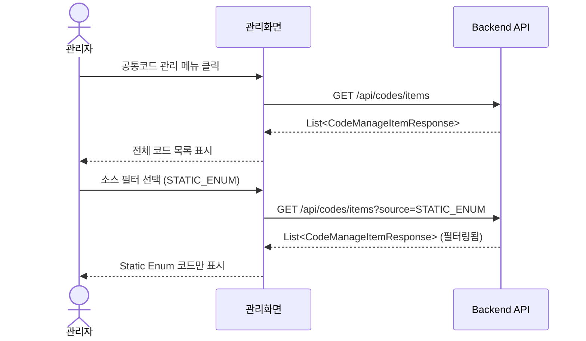
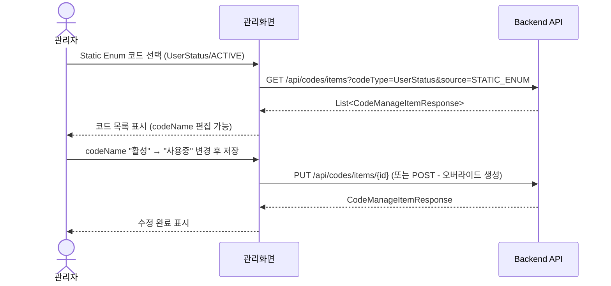
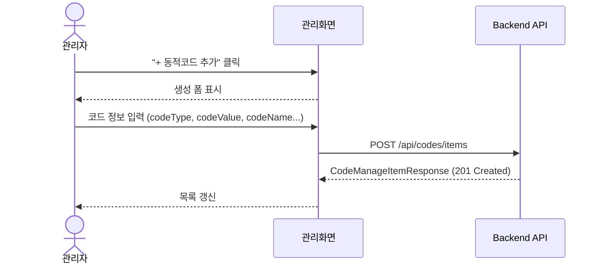

# SystemCommonCode 관리 API 설계서 (v2)

## 1. 개요

### 1.1 목적
시스템 공통코드(SystemCommonCode)를 효과적으로 관리하기 위한 RESTful API를 설계합니다.
정적 Enum 기반 코드와 동적 DB 관리 코드를 **통합하여** 일관된 인터페이스를 제공합니다.

### 1.2 코드 소스 타입 (CodeManageSource)

| 소스 | 설명 | 라벨 수정 | 코드 추가 | 코드 삭제 | DB 저장 |
|------|------|:--------:|:--------:|:--------:|:-------:|
| STATIC_ENUM | 프로젝트 Enum 기반 정적 코드 | ✅ | ❌ | ❌ | 오버라이드만 |
| DYNAMIC_DB | DB에서 관리되는 동적 공통코드 | ✅ | ✅ | ✅ | ✅ |
| DW | 데이터웨어하우스 연동 코드 | ❌ | ❌ | ❌ | ❌ |
| APPROVAL_GROUP | 승인 그룹 Entity 기반 코드 | ❌ | ❌ | ❌ | ❌ |
| FEDERATED | 외부 시스템 API 연동 코드 | ❌ | ❌ | ❌ | ❌ |

### 1.3 주요 개념

#### Static Enum 오버라이드
- Static Enum은 코드(codeValue) 자체는 Enum에서 정의되어 변경 불가
- 하지만 DB에 동일한 codeType/codeValue로 레코드를 저장하여 **라벨, 순서, 설명**을 커스터마이징 가능
- 조회 시 DB 오버라이드 값이 있으면 우선 적용

#### 마이그레이션
- Enum 클래스명이 변경되면 codeType도 변경됨
- DB에 저장된 기존 codeType을 새 codeType으로 마이그레이션 필요
- 마이그레이션 상태 조회 API로 불일치 감지 → 마이그레이션 실행

---

## 2. UI 시나리오

### 2.1 통합 코드 관리 화면

```
┌──────────────────────────────────────────────────────────────────────┐
│                      공통코드 통합 관리                                │
├──────────────────────────────────────────────────────────────────────┤
│  [필터]                                                               │
│    소스: [전체 ▼] [STATIC_ENUM] [DYNAMIC_DB] [DW] ...                 │
│    코드타입: [________________]                                        │
│    검색: [________________] [검색]                                     │
├──────────────────────────────────────────────────────────────────────┤
│  [+ 동적코드 추가]  [마이그레이션 관리]                                │
├──────────────────────────────────────────────────────────────────────┤
│  │ 코드타입      │ 코드값   │ 코드명     │ 소스        │ 수정│ 순서│ │
│  │──────────────┼─────────┼───────────┼────────────┼────┼─────│ │
│  │ UserStatus   │ ACTIVE  │ 활성      │ STATIC_ENUM │ ✅  │ 1   │ │
│  │ UserStatus   │ INACTIVE│ 비활성    │ STATIC_ENUM │ ✅  │ 2   │ │
│  │ UserStatus   │ LOCKED  │ (미설정)  │ STATIC_ENUM │ ✅  │ 3   │ │
│  │ NOTICE_CAT.. │ CAT001  │ 일반공지  │ DYNAMIC_DB  │ ✅  │ 1   │ │
│  │ NOTICE_CAT.. │ CAT002  │ 긴급      │ DYNAMIC_DB  │ ✅  │ 0   │ │
│  │ DeptCode     │ DEV     │ 개발팀    │ DW          │ ❌  │ 1   │ │
└──────────────────────────────────────────────────────────────────────┘
```

**특징:**
- codeType path variable 없이 **전체 코드를 플랫하게 표시**
- `source` 쿼리 파라미터로 소스별 필터링
- Static Enum의 codeName이 없으면 "(미설정)" 표시
- **페이징 없음** - 전체 목록 반환

### 2.2 마이그레이션 관리 화면

```
┌──────────────────────────────────────────────────────────────────────┐
│                      코드 타입 마이그레이션                           │
├──────────────────────────────────────────────────────────────────────┤
│  [Enum에만 존재 (신규 - DB 미등록)]                                    │
│  ┌────────────────────────────────────────────────────────────────┐  │
│  │ Enum 타입명    │ 코드 수 │ 설명              │ 액션            │  │
│  │───────────────┼────────┼──────────────────┼────────────────│  │
│  │ NewUserRole   │ 5      │ 새 사용자 역할    │ [DB 초기화]    │  │
│  │ PaymentMethod │ 3      │ 결제 수단         │ [DB 초기화]    │  │
│  └────────────────────────────────────────────────────────────────┘  │
│                                                                       │
│  [DB에만 존재 (Enum 삭제됨/이름 변경됨)]                               │
│  ┌────────────────────────────────────────────────────────────────┐  │
│  │ DB 타입명      │ 코드 수 │ 상태              │ 액션            │  │
│  │───────────────┼────────┼──────────────────┼────────────────│  │
│  │ OldUserRole   │ 5      │ Enum 없음        │ [마이그레이션] │  │
│  │               │        │                   │ [삭제]         │  │
│  │ LegacyType    │ 2      │ Enum 없음        │ [마이그레이션] │  │
│  │               │        │                   │ [삭제]         │  │
│  └────────────────────────────────────────────────────────────────┘  │
│                                                                       │
│  [마이그레이션 실행]                                                   │
│  ┌────────────────────────────────────────────────────────────────┐  │
│  │  Source: [OldUserRole ▼]  →  Target: [NewUserRole ▼]  [실행]  │  │
│  └────────────────────────────────────────────────────────────────┘  │
└──────────────────────────────────────────────────────────────────────┘
```

**마이그레이션 시나리오:**
1. Enum 클래스명 변경: `OldUserRole` → `NewUserRole`
2. 마이그레이션 상태 조회로 DB에만 존재하는 `OldUserRole` 발견
3. 마이그레이션 대상으로 `NewUserRole` 선택
4. 실행 → DB의 codeType이 `OldUserRole` → `NewUserRole`로 일괄 변경

### 2.3 사용자 플로우

#### 플로우 1: 통합 코드 목록 조회


#### 플로우 2: Static Enum 라벨 수정


#### 플로우 3: 동적 코드 추가


---

## 3. API 명세

### 3.1 기본 정보

- **Base URL**: `/api/codes`
- **Content-Type**: `application/json`
- **인증**: JWT Bearer Token
- **권한**: `@RequirePermission(feature = COMMON_CODE, action = READ/UPDATE)`

---

### 3.2 조회 API

#### 3.2.1 통합 코드 항목 목록 조회 (메인 API)

모든 소스의 코드를 통합하여 조회합니다. **페이징 없음.**

```http
GET /api/codes/items
Authorization: Bearer {token}
```

**Query Parameters:**
| 파라미터 | 타입 | 필수 | 설명 |
|----------|------|:----:|------|
| source | string | ❌ | 소스 필터 (STATIC_ENUM, DYNAMIC_DB, DW 등, 쉼표 구분 가능) |
| codeType | string | ❌ | 코드 타입 필터 |
| active | boolean | ❌ | 활성 상태 필터 (미지정시 전체) |
| search | string | ❌ | 코드값/코드명 검색 |

**Response**: `200 OK`
```json
[
  {
    "id": null,
    "codeType": "UserStatus",
    "codeValue": "ACTIVE",
    "codeName": "활성",
    "displayOrder": 1,
    "active": true,
    "source": "STATIC_ENUM",
    "description": "활성 상태 사용자",
    "metadataJson": null,
    "editable": true,
    "deletable": false,
    "hasDbOverride": true,
    "updatedAt": "2025-01-15T10:30:00Z",
    "updatedBy": "admin"
  },
  {
    "id": null,
    "codeType": "UserStatus",
    "codeValue": "LOCKED",
    "codeName": null,
    "displayOrder": 3,
    "active": true,
    "source": "STATIC_ENUM",
    "description": null,
    "metadataJson": null,
    "editable": true,
    "deletable": false,
    "hasDbOverride": false,
    "updatedAt": null,
    "updatedBy": null
  },
  {
    "id": "550e8400-e29b-41d4-a716-446655440000",
    "codeType": "NOTICE_CATEGORY",
    "codeValue": "CAT001",
    "codeName": "일반공지",
    "displayOrder": 1,
    "active": true,
    "source": "DYNAMIC_DB",
    "description": "일반 공지사항",
    "metadataJson": "{\"icon\": \"info\"}",
    "editable": true,
    "deletable": true,
    "hasDbOverride": false,
    "updatedAt": "2025-01-15T10:30:00Z",
    "updatedBy": "admin"
  }
]
```

**특이사항:**
- Static Enum의 `codeName`이 null이면 UI에서 "(미설정)" 등으로 표시
- `hasDbOverride`: Static Enum이 DB 오버라이드 레코드를 가지고 있는지 여부
- `id`: Static Enum은 DB 레코드가 없으면 null, 오버라이드가 있으면 해당 ID

---

#### 3.2.2 특정 codeType + source 조회 (단일 타입 조회)

특정 코드 타입과 소스 조합의 코드 목록을 조회합니다.

```http
GET /api/codes/items?codeType=UserStatus&source=STATIC_ENUM
Authorization: Bearer {token}
```

**Response**: `200 OK` - `List<CodeManageItemResponse>`

> 이 API는 3.2.1과 동일하며, 쿼리 파라미터로 필터링합니다.

---

#### 3.2.3 코드 타입 메타정보 조회

```http
GET /api/codes/types
Authorization: Bearer {token}
```

**Response**: `200 OK`
```json
[
  {
    "codeType": "UserStatus",
    "displayName": "사용자 상태",
    "description": "사용자 계정 상태를 나타내는 코드",
    "group": "USER",
    "source": "STATIC_ENUM",
    "editable": true,
    "addable": false,
    "itemCount": 3
  },
  {
    "codeType": "NOTICE_CATEGORY",
    "displayName": "공지사항 카테고리",
    "description": "공지사항 분류 코드",
    "group": "SYSTEM",
    "source": "DYNAMIC_DB",
    "editable": true,
    "addable": true,
    "itemCount": 5
  }
]
```

---

#### 3.2.4 여러 코드 타입 일괄 조회 (기존 호환)

```http
GET /api/codes/batch?types=UserStatus,NOTICE_CATEGORY
Authorization: Bearer {token}
```

**Response**: `200 OK` - `Map<String, List<CodeManageItem>>`

---

### 3.3 수정 API

#### 3.3.1 동적 코드 생성 (DYNAMIC_DB만)

새로운 동적 코드를 생성합니다.

```http
POST /api/codes/items
Authorization: Bearer {token}
Content-Type: application/json

{
  "codeType": "NOTICE_CATEGORY",
  "codeValue": "CAT003",
  "codeName": "이벤트",
  "displayOrder": 3,
  "active": true,
  "description": "이벤트 공지",
  "metadataJson": null
}
```

**Request Body:**
| 필드 | 타입 | 필수 | 제약조건 | 설명 |
|------|------|:----:|----------|------|
| codeType | string | ✅ | 최대 64자 | 코드 타입 |
| codeValue | string | ✅ | 최대 128자, 동일 타입 내 유일 | 코드 값 |
| codeName | string | ✅ | 최대 255자 | 코드 표시명 |
| displayOrder | int | ❌ | 기본값: 0 | 표시 순서 |
| active | boolean | ❌ | 기본값: true | 활성 상태 |
| description | string | ❌ | 최대 512자 | 설명 |
| metadataJson | string | ❌ | 유효한 JSON, 최대 2000자 | 메타데이터 |

**Response**: `201 Created`
```json
{
  "id": "550e8400-e29b-41d4-a716-446655440001",
  "codeType": "NOTICE_CATEGORY",
  "codeValue": "CAT003",
  "codeName": "이벤트",
  "displayOrder": 3,
  "active": true,
  "source": "DYNAMIC_DB",
  "description": "이벤트 공지",
  "metadataJson": null,
  "editable": true,
  "deletable": true,
  "hasDbOverride": false,
  "updatedAt": "2025-01-15T10:35:00Z",
  "updatedBy": "admin"
}
```

**Error Responses:**

| Status | 상황 |
|--------|------|
| 400 | 유효성 검사 실패 (필수 필드 누락 등) |
| 403 | Static Enum 타입에 코드 추가 시도 |
| 409 | 중복 codeType + codeValue |

---

#### 3.3.2 코드 수정 (DYNAMIC_DB + STATIC_ENUM)

기존 코드의 라벨, 순서, 설명 등을 수정합니다.

```http
PUT /api/codes/items/{id}
Authorization: Bearer {token}
Content-Type: application/json

{
  "codeName": "활성 상태",
  "displayOrder": 0,
  "active": true,
  "description": "사용 가능한 상태",
  "metadataJson": null
}
```

**Path Parameters:**
| 파라미터 | 타입 | 설명 |
|----------|------|------|
| id | UUID | 코드 항목 ID (또는 codeType + codeValue 조합 사용 가능) |

**Request Body:**
| 필드 | 타입 | 필수 | 설명 |
|------|------|:----:|------|
| codeName | string | ❌ | 코드 표시명 |
| displayOrder | int | ❌ | 표시 순서 |
| active | boolean | ❌ | 활성 상태 (DYNAMIC_DB만) |
| description | string | ❌ | 설명 |
| metadataJson | string | ❌ | 메타데이터 |

**Response**: `200 OK` - `CodeManageItemResponse`

**Static Enum 수정 동작:**
- DB에 오버라이드 레코드가 없으면 **새로 생성**
- 오버라이드 레코드가 있으면 **업데이트**
- `codeType`, `codeValue`는 Enum에서 정의되므로 **변경 불가**

---

#### 3.3.3 코드 수정 (codeType + codeValue로)

ID 대신 codeType과 codeValue로 수정합니다.

```http
PUT /api/codes/items?codeType=UserStatus&codeValue=ACTIVE&source=STATIC_ENUM
Authorization: Bearer {token}
Content-Type: application/json

{
  "codeName": "활성 상태",
  "displayOrder": 0,
  "description": "사용 가능한 상태"
}
```

---

#### 3.3.4 코드 삭제 (DYNAMIC_DB만)

```http
DELETE /api/codes/items/{id}
Authorization: Bearer {token}
```

**Response**: `204 No Content`

**제약:**
- DYNAMIC_DB만 삭제 가능
- STATIC_ENUM은 오버라이드 레코드만 삭제 가능 (원본 Enum은 유지)

---

#### 3.3.5 Static Enum 오버라이드 삭제

Static Enum의 DB 오버라이드 레코드를 삭제하여 원본 값으로 복원합니다.

```http
DELETE /api/codes/items/{id}/override
Authorization: Bearer {token}
```

**Response**: `204 No Content`

---

### 3.4 마이그레이션 API

#### 3.4.1 마이그레이션 상태 조회

Enum과 DB 간의 codeType 불일치 상태를 조회합니다.

```http
GET /api/codes/migration/status
Authorization: Bearer {token}
```

**Response**: `200 OK`
```json
{
  "enumOnlyTypes": [
    {
      "codeType": "NewUserRole",
      "itemCount": 5,
      "description": "신규 Enum (DB에 오버라이드 레코드 없음)"
    },
    {
      "codeType": "PaymentMethod",
      "itemCount": 3,
      "description": "결제 수단"
    }
  ],
  "dbOnlyTypes": [
    {
      "codeType": "OldUserRole",
      "itemCount": 5,
      "description": "Enum에서 삭제됨 또는 이름 변경됨"
    },
    {
      "codeType": "LegacyType",
      "itemCount": 2,
      "description": "Enum에서 삭제됨 또는 이름 변경됨"
    }
  ],
  "syncedTypes": [
    {
      "codeType": "UserStatus",
      "enumCount": 3,
      "dbOverrideCount": 2,
      "synced": true
    }
  ]
}
```

**필드 설명:**
- `enumOnlyTypes`: Enum에만 존재하고 DB에 레코드가 없는 타입들
- `dbOnlyTypes`: DB에만 존재하고 Enum에 없는 타입들 (마이그레이션 대상)
- `syncedTypes`: Enum과 DB가 동기화된 타입들

---

#### 3.4.2 마이그레이션 실행

DB의 codeType을 일괄 변경합니다.

```http
POST /api/codes/migration
Authorization: Bearer {token}
Content-Type: application/json

{
  "oldCodeType": "OldUserRole",
  "newCodeType": "NewUserRole"
}
```

**Request Body:**
| 필드 | 타입 | 필수 | 설명 |
|------|------|:----:|------|
| oldCodeType | string | ✅ | 기존 코드 타입 (DB에만 존재) |
| newCodeType | string | ✅ | 새 코드 타입 (Enum에 존재) |

**Response**: `200 OK`
```json
{
  "success": true,
  "migratedCount": 5,
  "oldCodeType": "OldUserRole",
  "newCodeType": "NewUserRole",
  "message": "5개 코드가 OldUserRole에서 NewUserRole로 마이그레이션되었습니다."
}
```

**Error Responses:**
| Status | 상황 |
|--------|------|
| 400 | oldCodeType이 DB에 없음 |
| 400 | newCodeType이 Enum에 없음 |
| 409 | newCodeType에 이미 DB 레코드 존재 |

---

#### 3.4.3 DB 전용 코드 타입 삭제

Enum에 없는 DB 전용 코드 타입을 삭제합니다.

```http
DELETE /api/codes/migration/{codeType}
Authorization: Bearer {token}
```

**Response**: `204 No Content`

---

### 3.5 유틸리티 API

#### 3.5.1 캐시 무효화

```http
POST /api/codes/cache/evict?codeType=NOTICE_CATEGORY
Authorization: Bearer {token}
```

**Query Parameters:**
| 파라미터 | 타입 | 필수 | 설명 |
|----------|------|:----:|------|
| codeType | string | ❌ | 무효화할 코드 타입 (미지정시 전체) |

**Response**: `200 OK`

---

## 4. DTO 스키마

### 4.1 CodeManageItemResponse (통합 조회 응답)

```java
/**
 * 코드 항목 통합 응답 DTO.
 * 모든 소스(Static Enum, Dynamic DB, DW 등)의 코드를 통일된 형식으로 표현.
 */
public record CodeManageItemResponse(
    UUID id,                    // DB ID (Static Enum은 오버라이드 없으면 null)
    String codeType,            // 코드 타입
    String codeValue,           // 코드 값
    String codeName,            // 코드명 (Static Enum은 null일 수 있음)
    Integer displayOrder,       // 표시 순서
    boolean active,             // 활성 상태
    CodeManageSource source,    // 소스 타입
    String description,         // 설명
    String metadataJson,        // 메타데이터 (JSON)
    boolean editable,           // 라벨 수정 가능 여부
    boolean deletable,          // 삭제 가능 여부
    boolean hasDbOverride,      // Static Enum의 DB 오버라이드 존재 여부
    OffsetDateTime updatedAt,   // 수정일시
    String updatedBy            // 수정자
) {}
```

### 4.2 CodeTypeInfo (타입 메타정보)

```java
public record CodeTypeInfo(
    String codeType,            // 코드 타입명
    String displayName,         // 표시명
    String description,         // 설명
    String group,               // 그룹
    CodeManageSource source,    // 소스 타입
    boolean editable,           // 라벨 수정 가능
    boolean addable,            // 코드 추가 가능
    int itemCount               // 코드 항목 수
) {}
```

### 4.3 CodeManageItemRequest (생성/수정 요청)

```java
public record CodeManageItemRequest(
    String codeType,            // 생성 시 필수, 수정 시 무시
    String codeValue,           // 생성 시 필수, 수정 시 무시
    @Size(max = 255) String codeName,
    Integer displayOrder,
    Boolean active,             // Dynamic DB만
    @Size(max = 512) String description,
    @Size(max = 2000) String metadataJson
) {}
```

### 4.4 MigrationStatusResponse (마이그레이션 상태)

```java
public record MigrationStatusResponse(
    List<CodeTypeStatus> enumOnlyTypes,
    List<CodeTypeStatus> dbOnlyTypes,
    List<SyncedTypeStatus> syncedTypes
) {}

public record CodeTypeStatus(
    String codeType,
    int itemCount,
    String description
) {}

public record SyncedTypeStatus(
    String codeType,
    int enumCount,
    int dbOverrideCount,
    boolean synced
) {}
```

### 4.5 MigrationRequest/Response

```java
public record MigrationRequest(
    @NotBlank String oldCodeType,
    @NotBlank String newCodeType
) {}

public record MigrationResponse(
    boolean success,
    int migratedCount,
    String oldCodeType,
    String newCodeType,
    String message
) {}
```

---

## 5. 비즈니스 규칙

### 5.1 소스별 권한 매트릭스

| 소스 | 조회 | 라벨 수정 | 코드 추가 | 코드 삭제 | 오버라이드 삭제 |
|------|:----:|:--------:|:--------:|:--------:|:-------------:|
| STATIC_ENUM | ✅ | ✅ | ❌ | ❌ | ✅ |
| DYNAMIC_DB | ✅ | ✅ | ✅ | ✅ | N/A |
| DW | ✅ | ❌ | ❌ | ❌ | N/A |
| APPROVAL_GROUP | ✅ | ❌ | ❌ | ❌ | N/A |
| FEDERATED | ✅ | ❌ | ❌ | ❌ | N/A |

### 5.2 Static Enum 오버라이드 규칙

1. **조회 시**: DB 오버라이드 값이 있으면 우선 적용
2. **수정 시**:
   - 오버라이드 레코드 없으면 새로 생성
   - 오버라이드 레코드 있으면 업데이트
3. **삭제 시**: 오버라이드 레코드만 삭제 (원본 Enum은 유지)
4. **codeName이 null인 항목**: UI에서 "(미설정)" 등으로 표시

### 5.3 마이그레이션 규칙

1. **마이그레이션 대상**: DB에만 존재하는 codeType
2. **마이그레이션 목적지**: Enum에 존재하는 codeType
3. **충돌 방지**: 목적지에 이미 DB 레코드가 있으면 409 에러
4. **롤백**: 트랜잭션 처리로 실패 시 원복

---

## 6. 에러 코드

| HTTP Status | 코드 | 설명 |
|-------------|------|------|
| 400 | VALIDATION_ERROR | 입력값 검증 실패 |
| 400 | INVALID_JSON | metadataJson 형식 오류 |
| 400 | INVALID_CODE_TYPE | 존재하지 않는 코드 타입 |
| 403 | STATIC_CODE_ADD_FORBIDDEN | Static Enum에 코드 추가 시도 |
| 403 | READONLY_SOURCE | 읽기 전용 소스 수정 시도 (DW 등) |
| 404 | CODE_NOT_FOUND | 코드 항목 없음 |
| 409 | DUPLICATE_CODE | 중복 codeType + codeValue |
| 409 | MIGRATION_CONFLICT | 마이그레이션 대상에 이미 레코드 존재 |

---

## 7. 구현 체크리스트

### 7.1 서비스 레이어
- [ ] `CodeManageQueryService.findAllItems()` - 통합 조회 (필터 지원)
- [ ] `CodeManageQueryService.getMigrationStatus()` - 마이그레이션 상태
- [ ] `SystemCommonCodeService.createOrUpdateOverride()` - Static Enum 오버라이드
- [ ] `SystemCommonCodeService.deleteOverride()` - 오버라이드 삭제
- [ ] `SystemCommonCodeService.migrate()` - 마이그레이션 실행

### 7.2 Repository
- [ ] `SystemCommonCodeRepository.findByCodeType()` - 특정 타입 조회
- [ ] `SystemCommonCodeRepository.findByCodeTypeAndCodeValue()` - 단일 조회
- [ ] `SystemCommonCodeRepository.updateCodeType()` - 마이그레이션용 벌크 업데이트

### 7.3 컨트롤러
- [ ] `GET /api/codes/items` - 통합 조회
- [ ] `POST /api/codes/items` - 동적 코드 생성
- [ ] `PUT /api/codes/items/{id}` - 코드 수정
- [ ] `DELETE /api/codes/items/{id}` - 코드 삭제
- [ ] `DELETE /api/codes/items/{id}/override` - 오버라이드 삭제
- [ ] `GET /api/codes/migration/status` - 마이그레이션 상태
- [ ] `POST /api/codes/migration` - 마이그레이션 실행
- [ ] `DELETE /api/codes/migration/{codeType}` - DB 전용 타입 삭제

### 7.4 테스트
- [ ] 통합 조회 API 테스트 (필터 조합)
- [ ] Static Enum 오버라이드 CRUD 테스트
- [ ] Dynamic DB CRUD 테스트
- [ ] 마이그레이션 시나리오 테스트
- [ ] 권한 검증 테스트

---

## 8. 변경 이력

| 버전 | 날짜 | 변경 내용 |
|------|------|----------|
| v1 | 2025-01-15 | 초안 작성 |
| v2 | 2025-01-15 | 요구사항 반영: 페이징 제거, source 필터, 통합 조회, Static Enum 수정, 마이그레이션 기능 |
