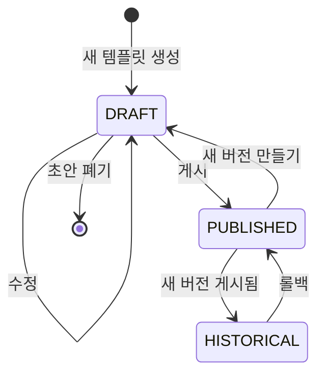

# DraftFormTemplate UI 시나리오 설계 (v3 - 최종)

> **문서 버전**: 3.0
> **작성일**: 2025-01-30
> **대상**: Nuxt 4 프론트엔드 개발
> **MVP 범위**: Visual Schema Builder + 버전관리 포함
> **검토 상태**: ✅ 확정

---

## 📋 목차

1. [도메인 개요](#1-도메인-개요)
2. [MVP 기능 범위](#2-mvp-기능-범위)
3. [화면 구조 및 라우팅](#3-화면-구조-및-라우팅)
4. [Visual Schema Builder 상세](#4-visual-schema-builder-상세)
5. [버전 관리 상세](#5-버전-관리-상세)
6. [API 명세](#6-api-명세)
7. [상태 관리](#7-상태-관리)
8. [컴포넌트 설계](#8-컴포넌트-설계)
9. [검토 질문](#9-검토-질문)

---

## 1. 도메인 개요

### 1.1 DraftFormTemplate 구조

```
┌─────────────────────────────────────────────────────────────┐
│  DraftFormTemplateRoot (템플릿 그룹)                         │
│  ├── templateCode: "TPL-FILE-001"                           │
│  │                                                          │
│  └── versions (SCD Type 2 이력)                             │
│      ├── v1 (HISTORICAL) - 2024-01 ~ 2024-06               │
│      ├── v2 (HISTORICAL) - 2024-06 ~ 2025-01               │
│      ├── v3 (PUBLISHED)  - 2025-01 ~ 현재 ◀ 운영 버전      │
│      └── v4 (DRAFT)      - 미게시 ◀ 편집 중                 │
└─────────────────────────────────────────────────────────────┘
```

### 1.2 버전 상태 흐름



### 1.3 업무유형 (WorkType)

| 코드 | 한글명 | 기본 스키마 필드 |
|------|--------|-----------------|
| `GENERAL` | 일반 업무 | 제목, 내용, 첨부파일 |
| `FILE_EXPORT` | 파일 반출 | 반출유형, 기간, 파일목록, 보안확인 |
| `DATA_CORRECTION` | 데이터 정정 | 정정유형, 대상테이블, 정정내용 |
| `HR_UPDATE` | 인사정보 변경 | 대상자, 변경유형, 발효일 |
| `POLICY_CHANGE` | 정책 변경 | 정책유형, 변경범위, 영향도 |

---

## 2. MVP 기능 범위

### 2.1 MVP 포함 기능 ✅

| 기능 | 설명 | 우선순위 |
|------|------|---------|
| **템플릿 목록** | 필터/검색/페이징 | P0 |
| **Visual Schema Builder** | 드래그앤드롭 필드 편집기 | P0 |
| **실시간 미리보기** | 편집 중 폼 렌더링 | P0 |
| **초안(DRAFT) 관리** | 저장/게시/폐기 | P0 |
| **버전 히스토리** | 타임라인 뷰 | P0 |
| **버전 비교 (Diff)** | Side-by-side 비교 | P1 |
| **롤백** | 이전 버전 복원 | P1 |
| **Undo/Redo** | 스키마 편집 실행취소 | P1 |

### 2.2 1차 제외 기능 ❌

| 기능 | 제외 사유 | 향후 계획 |
|------|----------|----------|
| 템플릿 복제 | 스코프 제한 | 2차 |
| JSON 내보내기/가져오기 | 스코프 제한 | 2차 |
| 다국어 라벨 | 복잡도 | 2차 |
| 조건부 필드 표시 | 복잡도 | 2차 |

---

## 3. 화면 구조 및 라우팅

### 3.1 라우팅 구조

```
/admin/draft/form-templates
├── index                    # 템플릿 목록
├── create                   # 새 템플릿 생성
├── [id]                     # 템플릿 상세/편집
│   ├── index               # 기본 정보 + 스키마 뷰
│   ├── edit                # 스키마 빌더 (DRAFT만)
│   └── versions            # 버전 히스토리
└── compare                  # 버전 비교 (쿼리: v1, v2)
```

### 3.2 화면 흐름

```
┌────────────────────────────────────────────────────────────────────┐
│                                                                     │
│   [목록]                                                            │
│     │                                                               │
│     ├── [+ 새 템플릿] ──────────▶ [생성 페이지]                    │
│     │                               │                               │
│     │                               ▼                               │
│     │                         ┌──────────────┐                     │
│     │                         │ 기본정보 입력 │                     │
│     │                         │ (이름, 업무유형)│                    │
│     │                         └──────┬───────┘                     │
│     │                                │                              │
│     │                                ▼                              │
│     │                         ┌──────────────┐                     │
│     │                         │ Schema Builder│ ◀─┐                │
│     │                         │ + 미리보기    │   │ (수정)         │
│     │                         └──────┬───────┘   │                 │
│     │                                │           │                  │
│     │                           [저장/게시]      │                  │
│     │                                │           │                  │
│     │                                ▼           │                  │
│     ├── [상세보기] ──────────▶ [상세 페이지] ───┘                  │
│     │                           │                                   │
│     │                           ├── [버전관리] ──▶ [버전 히스토리]  │
│     │                           │                    │              │
│     │                           │                    ├── [비교]    │
│     │                           │                    └── [롤백]    │
│     │                           │                                   │
│     └── [게시/롤백] (목록에서)                                      │
│                                                                     │
└────────────────────────────────────────────────────────────────────┘
```

### 3.3 목록 화면

```
┌──────────────────────────────────────────────────────────────────┐
│  📋 양식 템플릿 관리                        [+ 새 템플릿 만들기]  │
├──────────────────────────────────────────────────────────────────┤
│                                                                   │
│  필터:  [업무유형 ▼]  [상태 ▼]   🔍 검색...                        │
│                                                                   │
├──────────────────────────────────────────────────────────────────┤
│  │ 템플릿명              │ 업무유형    │ 버전 │ 상태      │ 작업   │
│  ├───────────────────────┼─────────────┼──────┼───────────┼────────│
│  │ 📄 파일 반출 신청서    │ FILE_EXPORT │ v3   │ 🟢 게시됨  │  ⋮    │
│  │    TPL-FILE-001       │             │      │           │        │
│  ├───────────────────────┼─────────────┼──────┼───────────┼────────│
│  │ 📄 일반 업무 기안      │ GENERAL     │ v2   │ 🟡 초안   │  ⋮    │
│  │    TPL-GEN-001        │             │      │ (수정 중)  │        │
│  ├───────────────────────┼─────────────┼──────┼───────────┼────────│
│  │ 📄 인사 변경 신청      │ HR_UPDATE   │ v1   │ 🟢 게시됨  │  ⋮    │
│  │    TPL-HR-001         │             │      │           │        │
│  └───────────────────────┴─────────────┴──────┴───────────┴────────│
│                                                                   │
│  ◀ 1 2 3 ▶   15개 중 1-10                                        │
└──────────────────────────────────────────────────────────────────┘

⋮ 드롭다운 메뉴:
├── DRAFT 상태: [편집] [미리보기] [게시] [삭제]
├── PUBLISHED 상태: [보기] [새 버전 만들기] [버전 관리] [비활성화]
└── HISTORICAL 상태: [보기] [비교] [롤백]
```

---

## 4. Visual Schema Builder 상세

### 4.1 화면 레이아웃 (3-Panel)

```
┌──────────────────────────────────────────────────────────────────┐
│  [← 목록] 파일 반출 신청서 편집 (v4 - 초안)      [저장] [게시]    │
├──────────────────────────────────────────────────────────────────┤
│                                                                   │
│  ┌─ 필드 팔레트 ─┐  ┌─ 캔버스 ─────────────┐  ┌─ 속성 패널 ────┐ │
│  │               │  │                       │  │                 │ │
│  │ 📝 텍스트     │  │  ┌─────────────────┐  │  │ 📄 제목        │ │
│  │ 🔢 숫자       │  │  │ 📄 제목 (text)  │  │  │ ─────────────  │ │
│  │ 📅 날짜       │  │  │ 필수 ✓ 100자    │  │  │ name: title   │ │
│  │ ☰ 선택       │  │  └─────────────────┘  │  │ label: 제목    │ │
│  │ ☑ 체크박스   │  │           ↕           │  │                 │ │
│  │ 📎 파일      │  │  ┌─────────────────┐  │  │ [기본]          │ │
│  │ ⊞ 배열       │  │  │ ☰ 반출유형 ▼    │  │  │ 필수: [✓]      │ │
│  │ ⊟ 그룹       │  │  │ select          │  │  │ 최소: [1  ]    │ │
│  │               │  │  └─────────────────┘  │  │ 최대: [100]    │ │
│  │ ─────────── │  │           ↕           │  │                 │ │
│  │ [기본 템플릿]│  │  ┌─────────────────┐  │  │ [고급]          │ │
│  │ ▶ 파일반출   │  │  │ ⊟ 반출기간      │  │  │ 패턴: [    ]   │ │
│  │   데이터정정 │  │  │ ├ 시작일 📅     │  │  │ 힌트: [    ]   │ │
│  │   인사변경   │  │  │ └ 종료일 📅     │  │  │                 │ │
│  │               │  │  └─────────────────┘  │  │ [삭제]          │ │
│  │               │  │                       │  │                 │ │
│  │               │  │  [+ 필드 추가]        │  │                 │ │
│  └───────────────┘  └───────────────────────┘  └─────────────────┘ │
│                                                                   │
│  ┌─ 실시간 미리보기 ─────────────────────────────────────────────┐ │
│  │                                                                │ │
│  │  제목 *                    반출유형 *                          │ │
│  │  ┌──────────────────┐     ○ 일회성  ○ 정기  ○ 긴급           │ │
│  │  │                   │                                         │ │
│  │  └──────────────────┘     반출기간 *                           │ │
│  │                           ┌───────────┐ ~ ┌───────────┐       │ │
│  │                           │ 시작일 📅 │   │ 종료일 📅 │       │ │
│  │                           └───────────┘   └───────────┘       │ │
│  └────────────────────────────────────────────────────────────────┘ │
│                                                                   │
│  ↩️ Undo  ↪️ Redo                              변경사항 저장됨 ✓   │
└──────────────────────────────────────────────────────────────────┘
```

### 4.2 필드 타입별 속성

| 타입 | 기본 속성 | 고급 속성 |
|------|----------|----------|
| `text` | name, label, required, minLength, maxLength | pattern, placeholder, multiline, inputType(email/url/tel) |
| `number` | name, label, required, min, max | step, precision, currency |
| `date` | name, label, required, minDate, maxDate | dateType(date/datetime/time), format |
| `select` | name, label, required, options, multiple | searchable, displayType(dropdown/radio/checkbox) |
| `checkbox` | name, label, required, checkLabel | defaultValue |
| `file` | name, label, required, multiple | acceptedTypes, maxFileSize, maxFiles |
| `array` | name, label, required, itemFields | minItems, maxItems, addLabel |
| `group` | name, label, fields | collapsible, collapsed |

### 4.3 상호작용

| 액션 | 트리거 | 결과 |
|------|--------|------|
| 필드 추가 | 팔레트 → 캔버스 드래그 | 필드 카드 생성, 속성 패널 표시 |
| 필드 선택 | 캔버스 카드 클릭 | 속성 패널에 해당 필드 표시 |
| 필드 삭제 | 카드 X 버튼 또는 Delete키 | 확인 후 삭제 |
| 필드 이동 | 카드 드래그 | 순서 변경 |
| 속성 변경 | 속성 패널 입력 | 실시간 반영, 미리보기 갱신 |
| 기본 템플릿 로드 | 팔레트 템플릿 클릭 | 캔버스 전체 교체 (확인 필요) |
| Undo/Redo | Ctrl+Z / Ctrl+Y | 이전/다음 상태 복원 |

### 4.4 유효성 검사

```typescript
interface ValidationError {
  fieldIndex: number;
  fieldName: string;
  message: string;
  severity: 'error' | 'warning';
}

// 검사 규칙
const validationRules = [
  // 필수
  { rule: 'name은 필수', check: (f) => !!f.name },
  { rule: 'label은 필수', check: (f) => !!f.label },

  // 중복
  { rule: 'name 중복 불가', check: (fields) => uniqueNames(fields) },

  // 타입별
  { rule: 'select는 options 필수', check: (f) => f.type !== 'select' || f.options?.length > 0 },
  { rule: 'array는 itemFields 필수', check: (f) => f.type !== 'array' || f.itemFields?.length > 0 },
];
```

---

## 5. 버전 관리 상세

### 5.1 버전 히스토리 화면

```
┌──────────────────────────────────────────────────────────────────┐
│  [← 상세] 파일 반출 신청서 - 버전 히스토리                        │
├──────────────────────────────────────────────────────────────────┤
│                                                                   │
│  📌 현재 운영 버전: v3 (PUBLISHED)                                │
│  📝 작성 중 초안: v4 (DRAFT)                                      │
│                                                                   │
│  ═══════════════════════════════════════════════════════════════ │
│                                                                   │
│  ┌─ v4 ─────────────────────────────────────────────── 초안 ────┐│
│  │ 🟡 DRAFT                                                      ││
│  │ 생성: 2025-01-20 10:00                                        ││
│  │ 변경자: 홍길동                                                ││
│  │ 변경 사유: 보안 서약 문구 수정                                ││
│  │                                                               ││
│  │ [편집] [미리보기] [게시] [폐기]                               ││
│  └───────────────────────────────────────────────────────────────┘│
│                         │                                         │
│                         ▼                                         │
│  ┌─ v3 ─────────────────────────────────────────────── 현재 ────┐│
│  │ 🟢 PUBLISHED                                                  ││
│  │ 유효: 2025-01-15 ~ 현재                                       ││
│  │ 변경: UPDATE                                                  ││
│  │ 변경자: 홍길동                                                ││
│  │ 변경 사유: 보안 서약 필드 추가                                ││
│  │                                                               ││
│  │ [보기] [v4와 비교]                                            ││
│  └───────────────────────────────────────────────────────────────┘│
│                         │                                         │
│                         ▼                                         │
│  ┌─ v2 ─────────────────────────────────────────────── 이력 ────┐│
│  │ ⚪ HISTORICAL                                                 ││
│  │ 유효: 2024-06-01 ~ 2025-01-15                                 ││
│  │ 변경: UPDATE                                                  ││
│  │ 변경자: 김철수                                                ││
│  │ 변경 사유: 반출기간 필드 그룹화                               ││
│  │                                                               ││
│  │ [보기] [v3와 비교] [이 버전으로 롤백]                         ││
│  └───────────────────────────────────────────────────────────────┘│
│                         │                                         │
│                         ▼                                         │
│  ┌─ v1 ─────────────────────────────────────────────────────────┐│
│  │ ⚪ HISTORICAL                                                 ││
│  │ 유효: 2024-01-01 ~ 2024-06-01                                 ││
│  │ 변경: CREATE                                                  ││
│  │ 변경자: 박영희                                                ││
│  │ 변경 사유: 최초 생성                                          ││
│  │                                                               ││
│  │ [보기] [v3와 비교] [이 버전으로 롤백]                         ││
│  └───────────────────────────────────────────────────────────────┘│
│                                                                   │
└──────────────────────────────────────────────────────────────────┘
```

### 5.2 버전 비교 (Diff View)

```
┌──────────────────────────────────────────────────────────────────┐
│  버전 비교                                            [닫기 ✕]  │
├──────────────────────────────────────────────────────────────────┤
│                                                                   │
│  비교: [v2 ▼]  ↔  [v3 ▼]                                         │
│                                                                   │
│  ┌─ v2 (2024-06) ────────────┐  ┌─ v3 (2025-01) ────────────┐   │
│  │                            │  │                            │   │
│  │ 필드 목록 (5개):           │  │ 필드 목록 (6개):           │   │
│  │                            │  │                            │   │
│  │  ▪ title (text)            │  │  ▪ title (text)            │   │
│  │  ▪ exportType (select)     │  │  ▪ exportType (select)     │   │
│  │  ▪ startDate (date)    ◀──┼──┼─ ⊟ exportPeriod (group) ◀ 변경│
│  │  ▪ endDate (date)      ◀──┼──┼─   ├ startDate              │   │
│  │                            │  │    └ endDate                │   │
│  │  ▪ purpose (text)          │  │  ▪ purpose (text)          │   │
│  │  ▪ files (array)           │  │  ▪ files (array)           │   │
│  │                            │  │  ▪ securityConfirm ◀ 추가   │   │
│  │                            │  │    (checkbox)               │   │
│  │                            │  │                            │   │
│  └────────────────────────────┘  └────────────────────────────┘   │
│                                                                   │
│  ┌─ 변경 요약 ───────────────────────────────────────────────────┐│
│  │ + 1개 필드 추가: securityConfirm                              ││
│  │ ~ 2개 필드 그룹화: startDate, endDate → exportPeriod          ││
│  │ - 삭제된 필드 없음                                            ││
│  └───────────────────────────────────────────────────────────────┘│
│                                                                   │
│  ┌─ JSON Diff ───────────────────────────────────────────────────┐│
│  │ [탭: 필드 요약 | JSON Diff]                                    ││
│  │                                                                ││
│  │  @@ -10,6 +10,15 @@                                            ││
│  │     "name": "purpose",                                         ││
│  │     "type": "text"                                             ││
│  │   },                                                           ││
│  │ + {                                                            ││
│  │ +   "name": "securityConfirm",                                 ││
│  │ +   "type": "checkbox",                                        ││
│  │ +   "required": true                                           ││
│  │ + }                                                            ││
│  └───────────────────────────────────────────────────────────────┘│
│                                                                   │
│                                        [v2로 롤백] [닫기]        │
└──────────────────────────────────────────────────────────────────┘
```

### 5.3 롤백 확인 모달

```
┌─────────────────────────────────────────────────┐
│  ⚠️ 버전 롤백 확인                               │
├─────────────────────────────────────────────────┤
│                                                 │
│  v2 버전으로 롤백하시겠습니까?                   │
│                                                 │
│  ⚠️ 현재 운영 중인 v3가 이력으로 이동됩니다.    │
│  ⚠️ 롤백 후 새 버전이 생성됩니다.               │
│                                                 │
│  ┌─────────────────────────────────────────┐   │
│  │ ⚠️ 기존 초안(v4)이 있습니다.             │   │
│  │    롤백을 진행하면 기존 초안이 삭제됩니다. │   │
│  └─────────────────────────────────────────┘   │
│                                                 │
│  롤백 사유 *                                    │
│  ┌─────────────────────────────────────────┐   │
│  │                                          │   │
│  └─────────────────────────────────────────┘   │
│                                                 │
│                      [취소]  [롤백 실행]        │
└─────────────────────────────────────────────────┘

※ 기존 DRAFT가 없는 경우 경고 영역 숨김
```

---

## 6. API 명세

### 6.1 기존 API (구현됨)

| 메서드 | 경로 | 설명 |
|--------|------|------|
| `GET` | `/api/draft-admin/form-templates` | 템플릿 목록 조회 |
| `POST` | `/api/draft-admin/form-templates` | 새 템플릿 생성 |
| `PUT` | `/api/draft-admin/form-templates/{id}` | 템플릿 수정 |

### 6.2 추가 필요 API ✅

| 메서드 | 경로 | 설명 | Request | Response |
|--------|------|------|---------|----------|
| `GET` | `/api/draft-admin/form-templates/{id}` | 단일 템플릿 조회 | - | `DraftFormTemplateResponse` |
| `DELETE` | `/api/draft-admin/form-templates/{id}` | 초안 삭제 (DRAFT만) | - | `204 No Content` |
| `GET` | `/api/draft-admin/form-templates/root/{rootId}/versions` | 버전 히스토리 조회 | - | `List<DraftFormTemplateResponse>` |
| `POST` | `/api/draft-admin/form-templates/{id}/rollback` | 롤백 | `{ reason: string }` | `DraftFormTemplateResponse` |
| `GET` | `/api/draft-admin/form-template-schemas/{workType}` | 업무유형별 기본 스키마 | - | `DraftFormSchema` |

### 6.3 상세 API 명세

#### GET /api/draft-admin/form-templates/{id}

```yaml
summary: 단일 템플릿 조회
parameters:
  - name: id
    in: path
    required: true
    schema:
      type: string
      format: uuid
responses:
  200:
    content:
      application/json:
        schema:
          $ref: '#/components/schemas/DraftFormTemplateResponse'
  404:
    description: 템플릿을 찾을 수 없음
```

#### GET /api/draft-admin/form-templates/root/{rootId}/versions

```yaml
summary: 버전 히스토리 조회
parameters:
  - name: rootId
    in: path
    required: true
    schema:
      type: string
      format: uuid
responses:
  200:
    content:
      application/json:
        schema:
          type: array
          items:
            $ref: '#/components/schemas/DraftFormTemplateResponse'
```

#### POST /api/draft-admin/form-templates/{id}/rollback

```yaml
summary: 이전 버전으로 롤백
description: |
  HISTORICAL 상태의 버전을 현재 PUBLISHED 버전으로 복원합니다.
  새로운 버전이 생성되며, 기존 PUBLISHED는 HISTORICAL로 변경됩니다.
  ⚠️ 기존 DRAFT가 있는 경우 덮어쓰기됩니다 (confirmOverwrite 필요).
parameters:
  - name: id
    in: path
    required: true
    schema:
      type: string
      format: uuid
requestBody:
  content:
    application/json:
      schema:
        type: object
        required: [reason]
        properties:
          reason:
            type: string
            maxLength: 500
            description: 롤백 사유
          confirmOverwrite:
            type: boolean
            default: false
            description: 기존 DRAFT 덮어쓰기 확인 (DRAFT 있는 경우 필수)
responses:
  200:
    description: 롤백 성공, 새 버전 반환
    content:
      application/json:
        schema:
          $ref: '#/components/schemas/DraftFormTemplateResponse'
  400:
    description: HISTORICAL 상태가 아님
  404:
    description: 템플릿을 찾을 수 없음
  409:
    description: 기존 DRAFT 존재하며 confirmOverwrite=false
```

#### GET /api/draft-admin/form-template-schemas/{workType}

```yaml
summary: 업무유형별 기본 스키마 조회
description: FormSchemaBuilders에서 생성한 기본 스키마를 반환
parameters:
  - name: workType
    in: path
    required: true
    schema:
      $ref: '#/components/schemas/WorkType'
responses:
  200:
    content:
      application/json:
        schema:
          $ref: '#/components/schemas/DraftFormSchema'
```

---

## 7. 상태 관리

### 7.1 Pinia Store - 템플릿 관리

```typescript
// stores/draftFormTemplate.ts

export const useDraftFormTemplateStore = defineStore('draftFormTemplate', () => {
  // State
  const templates = ref<DraftFormTemplateResponse[]>([]);
  const current = ref<DraftFormTemplateResponse | null>(null);
  const versions = ref<DraftFormTemplateResponse[]>([]);
  const loading = ref(false);
  const error = ref<string | null>(null);

  const filter = reactive({
    workType: null as WorkType | null,
    activeOnly: true,
    search: '',
  });

  // Actions
  async function fetchTemplates() {
    loading.value = true;
    try {
      const params = new URLSearchParams();
      if (filter.workType) params.set('workType', filter.workType);
      params.set('activeOnly', String(filter.activeOnly));

      templates.value = await $fetch(`/api/draft-admin/form-templates?${params}`);
    } finally {
      loading.value = false;
    }
  }

  async function fetchTemplate(id: string) {
    current.value = await $fetch(`/api/draft-admin/form-templates/${id}`);
  }

  async function fetchVersions(rootId: string) {
    versions.value = await $fetch(
      `/api/draft-admin/form-templates/root/${rootId}/versions`
    );
  }

  async function createTemplate(request: DraftFormTemplateRequest) {
    return await $fetch('/api/draft-admin/form-templates', {
      method: 'POST',
      body: request,
    });
  }

  async function updateTemplate(id: string, request: DraftFormTemplateRequest) {
    return await $fetch(`/api/draft-admin/form-templates/${id}`, {
      method: 'PUT',
      body: request,
    });
  }

  async function deleteTemplate(id: string) {
    await $fetch(`/api/draft-admin/form-templates/${id}`, {
      method: 'DELETE',
    });
  }

  async function publishDraft(id: string) {
    return await $fetch(`/api/draft-admin/form-templates/${id}/publish`, {
      method: 'POST',
    });
  }

  async function rollback(id: string, reason: string) {
    return await $fetch(`/api/draft-admin/form-templates/${id}/rollback`, {
      method: 'POST',
      body: { reason },
    });
  }

  return {
    templates, current, versions, loading, error, filter,
    fetchTemplates, fetchTemplate, fetchVersions,
    createTemplate, updateTemplate, deleteTemplate,
    publishDraft, rollback,
  };
});
```

### 7.2 Pinia Store - 스키마 에디터

```typescript
// stores/schemaEditor.ts

export const useSchemaEditorStore = defineStore('schemaEditor', () => {
  // State
  const schema = ref<DraftFormSchema>(createEmptySchema());
  const selectedFieldIndex = ref<number>(-1);
  const history = ref<DraftFormSchema[]>([]);
  const historyIndex = ref(-1);
  const validationErrors = ref<ValidationError[]>([]);
  const isDirty = ref(false);

  // Getters
  const selectedField = computed(() =>
    selectedFieldIndex.value >= 0
      ? schema.value.fields[selectedFieldIndex.value]
      : null
  );

  const canUndo = computed(() => historyIndex.value > 0);
  const canRedo = computed(() => historyIndex.value < history.value.length - 1);

  // Actions
  function initSchema(initialSchema?: DraftFormSchema) {
    schema.value = initialSchema ?? createEmptySchema();
    history.value = [JSON.parse(JSON.stringify(schema.value))];
    historyIndex.value = 0;
    isDirty.value = false;
  }

  function pushHistory() {
    // 현재 위치 이후 히스토리 제거
    history.value = history.value.slice(0, historyIndex.value + 1);
    // 새 상태 추가
    history.value.push(JSON.parse(JSON.stringify(schema.value)));
    historyIndex.value = history.value.length - 1;
    isDirty.value = true;
  }

  function addField(field: FormField, index?: number) {
    const insertIndex = index ?? schema.value.fields.length;
    schema.value.fields.splice(insertIndex, 0, field);
    selectedFieldIndex.value = insertIndex;
    pushHistory();
  }

  function removeField(index: number) {
    schema.value.fields.splice(index, 1);
    selectedFieldIndex.value = -1;
    pushHistory();
  }

  function updateField(index: number, updates: Partial<FormField>) {
    schema.value.fields[index] = { ...schema.value.fields[index], ...updates };
    pushHistory();
  }

  function moveField(fromIndex: number, toIndex: number) {
    const [field] = schema.value.fields.splice(fromIndex, 1);
    schema.value.fields.splice(toIndex, 0, field);
    selectedFieldIndex.value = toIndex;
    pushHistory();
  }

  function undo() {
    if (canUndo.value) {
      historyIndex.value--;
      schema.value = JSON.parse(JSON.stringify(history.value[historyIndex.value]));
    }
  }

  function redo() {
    if (canRedo.value) {
      historyIndex.value++;
      schema.value = JSON.parse(JSON.stringify(history.value[historyIndex.value]));
    }
  }

  async function loadDefaultSchema(workType: WorkType) {
    const defaultSchema = await $fetch<DraftFormSchema>(
      `/api/draft-admin/form-template-schemas/${workType}`
    );
    initSchema(defaultSchema);
  }

  function validate(): boolean {
    validationErrors.value = validateSchema(schema.value);
    return validationErrors.value.length === 0;
  }

  return {
    schema, selectedFieldIndex, selectedField, isDirty,
    history, historyIndex, canUndo, canRedo,
    validationErrors,
    initSchema, pushHistory,
    addField, removeField, updateField, moveField,
    undo, redo, loadDefaultSchema, validate,
  };
});
```

---

## 8. 컴포넌트 설계

### 8.1 디렉토리 구조

```
components/
└── draft/
    └── template/
        ├── list/
        │   ├── TemplateList.vue        # 테이블 뷰
        │   ├── TemplateFilters.vue     # 필터 영역
        │   └── TemplateActions.vue     # 드롭다운 액션 메뉴
        │
        ├── builder/
        │   ├── SchemaBuilder.vue       # 메인 빌더 (3-panel)
        │   ├── FieldPalette.vue        # 좌측 필드 팔레트
        │   ├── FieldCanvas.vue         # 중앙 캔버스
        │   ├── FieldCard.vue           # 캔버스 내 필드 카드
        │   ├── PropertyPanel.vue       # 우측 속성 패널
        │   ├── FormPreview.vue         # 하단 미리보기
        │   └── fields/                 # 필드 타입별 속성 편집
        │       ├── TextFieldProps.vue
        │       ├── NumberFieldProps.vue
        │       ├── DateFieldProps.vue
        │       ├── SelectFieldProps.vue
        │       ├── CheckboxFieldProps.vue
        │       ├── FileFieldProps.vue
        │       ├── ArrayFieldProps.vue
        │       └── GroupFieldProps.vue
        │
        ├── version/
        │   ├── VersionHistory.vue      # 버전 히스토리 타임라인
        │   ├── VersionCard.vue         # 개별 버전 카드
        │   ├── VersionDiff.vue         # 버전 비교 뷰 (필드 요약 + JSON diff)
        │   └── RollbackModal.vue       # 롤백 확인 모달
        │
        └── shared/
            ├── TemplateBasicInfo.vue   # 기본정보 폼
            ├── SchemaPreview.vue       # 읽기 전용 스키마 뷰
            ├── StatusBadge.vue         # 상태 배지 (DRAFT/PUBLISHED/...)
            ├── ValidationErrors.vue    # 유효성 검사 오류 표시
            └── UnsavedChangesGuard.vue # 페이지 이탈 확인 가드
```

### 8.2 핵심 컴포넌트 Props/Emits

```typescript
// SchemaBuilder.vue
interface Props {
  initialSchema?: DraftFormSchema;
  readonly?: boolean;
}

interface Emits {
  (e: 'save', schema: DraftFormSchema): void;
  (e: 'publish', schema: DraftFormSchema): void;
  (e: 'dirty-change', isDirty: boolean): void;
}

// VersionHistory.vue
interface Props {
  rootId: string;
  currentVersionId: string;
}

interface Emits {
  (e: 'view', versionId: string): void;
  (e: 'compare', v1: string, v2: string): void;
  (e: 'rollback', versionId: string): void;
}

// VersionDiff.vue
interface Props {
  version1: DraftFormTemplateResponse;
  version2: DraftFormTemplateResponse;
}

interface Emits {
  (e: 'rollback', versionId: string): void;
  (e: 'close'): void;
}
```

---

## 9. 확정된 설계 결정사항

### 9.1 UI/UX 결정

| # | 항목 | 결정 | 비고 |
|---|------|------|------|
| Q1 | 목록 뷰 형식 | **테이블만** | 카드 뷰 불필요 |
| Q2 | 스키마 편집 모드 | **Visual만** | JSON 편집 모드 제외 |
| Q3 | 미리보기 위치 | **하단** | 기본 레이아웃 유지 |
| Q4 | 버전 비교 표시 | **JSON diff 포함** | 필드 요약 + JSON diff 모두 표시 |

### 9.2 동작 결정

| # | 항목 | 결정 | 구현 방식 |
|---|------|------|----------|
| Q5 | 페이지 이탈 확인 | **필요** | `beforeunload` 이벤트 + Vue Router guard |
| Q6 | 자동 저장 | **불필요** | 수동 저장만 지원 |
| Q7 | 게시 전 유효성 검사 실패 | **게시 차단 + 오류 표시** | 모든 오류 수정 후 게시 가능 |

### 9.3 권한/정책 결정

| # | 항목 | 결정 | 구현 방식 |
|---|------|------|----------|
| Q8 | DRAFT 동시 생성 | **불가** | 동일 rootId에 DRAFT 1개만 허용, 생성 시 서버에서 검증 |
| Q9 | 롤백 시 기존 DRAFT 처리 | **덮어쓰기 확인** | 모달로 "기존 초안을 덮어씁니다" 확인 후 진행 |

---

## 📎 부록

### A. 관련 파일 위치

**백엔드:**
- 엔티티: [DraftFormTemplate.java](backend/admin/src/main/java/com/example/admin/draft/domain/DraftFormTemplate.java)
- 스키마: [schema/](backend/admin/src/main/java/com/example/admin/draft/schema/)
- 빌더: [FormSchemaBuilders.java](backend/admin/src/main/java/com/example/admin/draft/schema/builder/FormSchemaBuilders.java)
- 컨트롤러: [DraftTemplateAdminController.java](backend/server/src/main/java/com/example/server/web/DraftTemplateAdminController.java)
- 서비스: [TemplateAdminService.java](backend/draft/src/main/java/com/example/draft/application/TemplateAdminService.java)

**프론트엔드 유틸:**
- Zod 변환: [docs/frontend/schema-to-zod/](docs/frontend/schema-to-zod/)

### B. 예상 개발 공수

| 기능 | 예상 공수 | 비고 |
|------|----------|------|
| 목록 화면 | 2일 | 필터, 페이징 포함 |
| Schema Builder | 5일 | 드래그앤드롭, 8개 필드 타입 |
| 미리보기 | 2일 | Zod 변환 활용 |
| 버전 히스토리 | 2일 | 타임라인 UI |
| 버전 비교 | 2일 | Side-by-side diff |
| 롤백 | 1일 | API 연동 |
| 통합 테스트 | 2일 | E2E |
| **합계** | **16일** | |

---

## 📌 다음 단계

### 1. 백엔드 API 구현 (4일)

| API | 우선순위 | 담당 |
|-----|---------|------|
| `GET /api/draft-admin/form-templates/{id}` | P0 | - |
| `DELETE /api/draft-admin/form-templates/{id}` | P0 | - |
| `GET /api/draft-admin/form-templates/root/{rootId}/versions` | P0 | - |
| `POST /api/draft-admin/form-templates/{id}/rollback` | P1 | - |
| `GET /api/draft-admin/form-template-schemas/{workType}` | P1 | - |

### 2. 프론트엔드 구현 (12일)

| 기능 | 예상 공수 | 순서 |
|------|----------|------|
| 목록 화면 (테이블 뷰, 필터, 페이징) | 2일 | 1 |
| Visual Schema Builder (3-panel) | 5일 | 2 |
| 실시간 미리보기 | 2일 | 3 |
| 버전 히스토리 + Diff (JSON diff 포함) | 2일 | 4 |
| 롤백 + 페이지 이탈 확인 | 1일 | 5 |

### 3. 테스트 (2일)

- E2E 테스트 (Playwright)
- API 통합 테스트

---

> **문서 확정일**: 2025-01-30
> **설계 승인자**: (사용자 확인 완료)
